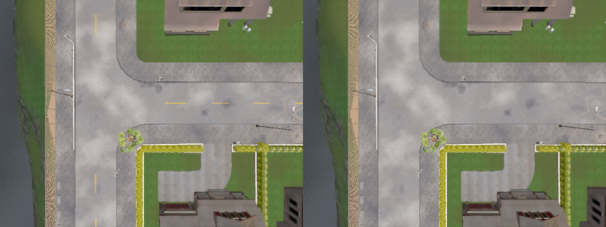
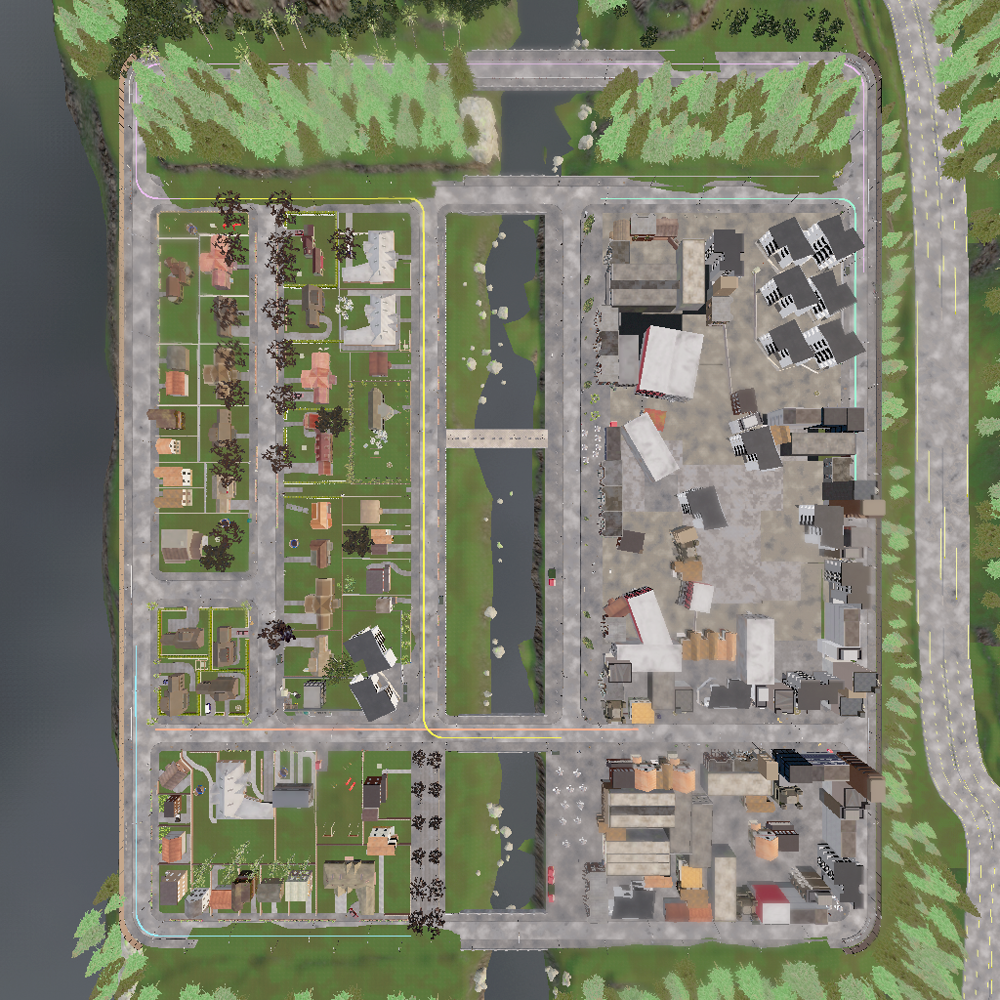
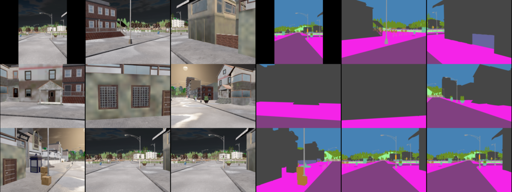
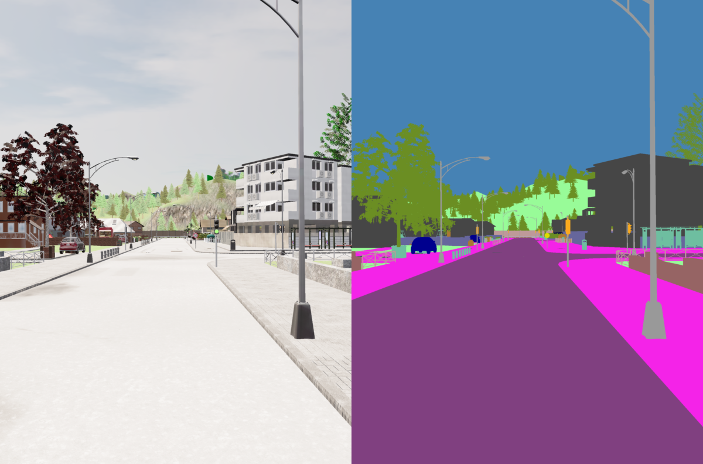
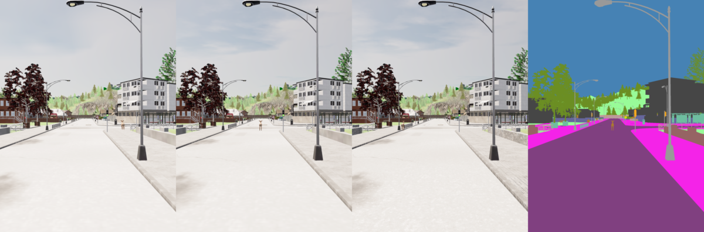

# Использование языковых моделей для изменения сцен в CARLA

## Постановка задачи и цель работы

Цель работы — разработать и проверить воспроизводимый подход к использованию языковых моделей для формирования дорожных сценариев в симуляторе CARLA. Пользовательский запрос должен преобразовываться в ограниченное описание изменений сцены, проходить автоматическую проверку и только после этого применяться средствами симулятора. Результат должен быть виден в данных виртуальных камер и пригоден для последующего анализа.

Работа объединяет несколько связанных задач. Сначала нужна стабильная среда CARLA и карта, которую можно менять через Python API. Затем необходимо выбрать маршруты движения, установить камеры, организовать синхронную запись RGB-изображений, семантической сегментации и положения автомобиля. После этого языковая модель должна получить простой текстовый запрос, описать сцену в безопасном формате, а заранее написанный исполнитель — применить только разрешённые изменения. Отдельная практическая проверка посвящена движущемуся животному, которого нет в стандартном наборе объектов выбранной версии CARLA.

В этой работе оценивается именно инженерный процесс: можно ли получить проверяемую сцену, сохранить все входы и результаты и затем повторить её без нового обращения к модели. Автомобиль в симуляторе следует навигационной карте CARLA и не принимает решения по записанным изображениям.

## Среда симуляции и подготовка карты

Симулятор CARLA 0.9.16 запускался в Docker на Ubuntu с NVIDIA GPU. Версии Python-клиента и сервера совпадали. Образ контейнера был закреплён по точному идентификатору, поэтому повторный запуск не зависит от случайного обновления образа. Для каждого эксперимента сохранялись параметры запуска, версия CARLA, конфигурация, число для фиксации случайного выбора (`seed`), журналы и результат проверки.

Основной картой стала `Town01_Opt`. Обычная `Town01` также была загружена и проверена, но доступные для неё операции не удаляли дорожную разметку из RGB-изображения. В `Town01_Opt` вызов CARLA API, отключающий объекты категории `RoadLines`, действительно убрал видимые жёлтые линии. Проверка проводилась с одинакового положения камеры на прямом участке, перекрёстке и рядом со светофорами. Число пикселей класса дорожной разметки в исходной семантической маске уменьшилось соответственно с 604, 512 и 550 до нуля. Навигационные точки дороги (`waypoint`) при этом остались доступны.

*Одинаковый участок карты: слева исходная сцена, справа сцена после отключения `RoadLines`. Изменяется видимая разметка, но не навигационный граф дороги.*

Эта операция проверена в трёх выбранных точках, поэтому результат не следует понимать как доказательство отсутствия абсолютно всех видов разметки на всей карте. В частности, API карты не вернул подходящую точку для отдельной проверки пешеходного перехода. Ещё одно важное ограничение: удаление линий из изображения не меняет поведение Traffic Manager, потому что он использует внутреннюю дорожную топологию, а не RGB-камеру.

## Выбор и проверка пяти маршрутов

Маршруты выбирались не как пять произвольных пар координат. Сначала из карты была получена полная сеть из 3266 навигационных точек с шагом 2 м. Кандидаты начинались в штатных точках появления автомобилей и строились только через переходы `Waypoint.next(2.0)`. Для каждого соседнего участка отдельно проверялось, что он действительно продолжает предыдущую точку. Это защищает от маршрута, который красиво выглядит сверху, но содержит разрыв или переход на недоступную полосу.

После машинной проверки маршруты просматривались на карте. Нужны были разные, но не избыточно длинные ситуации:

- прямой контрольный участок длиной 110 м;
- маршрут с одним левым поворотом длиной около 125 м;
- маршрут с одним правым поворотом длиной около 123 м;
- левый поворот с последующим полным проездом через внешний мост, около 251 м;
- маршрут с двумя последовательными поворотами — налево и направо, около 226 м.

На прямых участках рабочие точки разнесены примерно на 10 м, а около поворотов используются точки с шагом 2 м. При этом для контроля сохраняется исходная непрерывная цепочка с шагом 2 м. На пяти итоговых маршрутах осталось соответственно 12, 32, 32, 44 и 60 рабочих точек. Такое сокращение уменьшило суммарное время движения примерно вдвое, но сохранило левый и правый повороты, мост и более сложную последовательность манёвров.

*Общий вид семейства маршрутов во время визуального отбора. Для рабочих заездов эти же связные геометрии были укорочены и упорядочены по сложности.*

Одной проверки координат было недостаточно, поэтому по каждому маршруту проехал Tesla Model 3 под управлением Traffic Manager. Все пять заездов завершились без столкновений, зависаний и тайм-аутов. Максимальное отклонение автомобиля от заданной линии находилось в диапазоне примерно от 1,0 до 1,25 м. После достижения конца маршрута автопилот отключался, а автомобиль останавливался. Для фактического управления применялись понятные Traffic Manager команды `Straight`, `Left` и `Right`: передача длинного списка координат через `set_path` в ранних пробах не гарантировала выбор нужной ветки дороги.

## Камеры и запись набора данных

На автомобиль были перенесены девять положений камер из Argoverse 2: семь кольцевых камер и две передние стереокамеры. Для каждой позиции создавались два сенсора CARLA — обычная RGB-камера и камера семантической сегментации. Всего одновременно работало 18 сенсоров.

Положение каждой камеры рассчитывалось относительно задней оси автомобиля. Координатные оси Argoverse и CARLA были явно преобразованы, а исходные параметры калибровки сохранены рядом с результатами. После первого визуального теста камеры были подняты на 0,5 м: при точном переносе исходной высоты в нижнюю часть изображения попадал кузов Tesla. Это изменение задокументировано и не выдаётся за точное физическое воспроизведение автомобиля Argoverse.

Симуляция работала с фиксированным шагом 0,05 с, а данные принимались с частотой 2 Гц времени симуляции. Кадр записывался только тогда, когда для одного и того же номера кадра были получены все 18 изображений и состояние автомобиля из того же снимка мира. Семантические классы сохранялись как исходные 8-битные ID без потери информации. Цветная палитра CARLA создавалась отдельно только для просмотра человеком. Для каждого принятого момента также сохранялись координаты и ориентация автомобиля.

*Слева — один синхронный набор RGB-изображений со всех девяти позиций, справа — соответствующие цветные представления семантических масок. Исходные ID классов хранятся отдельно.*

Короткая проверка всей системы дала четыре полностью согласованных момента времени: 72 обязательных изображения от 18 сенсоров, 36 цветных семантических превью и четыре положения автомобиля. Не было потерянных, повторных или опоздавших кадров. Все PNG-файлы прошли проверку сигнатуры, размера и декодирования, а на контактных листах не было видно кузова автомобиля.

После этого была записана базовая выборка: пять маршрутов, две настройки погоды и один заезд для каждой пары. Все десять заездов завершились без столкновений и прошли проверки маршрута и данных. В итоговой выборке содержится 339 синхронных моментов, 3051 RGB-изображение, 3051 исходная семантическая маска и 3051 цветное превью — всего 9153 PNG-файла. Запись охватывает 164,5 с времени симуляции и занимает около 12,9 ГБ.

Из-за большого объёма PNG кодирование было вынесено в ограниченную очередь из четырёх рабочих потоков. Когда очередь заполнялась, симуляция ожидала освобождения места и не выбрасывала кадры. Это важнее максимальной скорости: для набора данных пропуск кадра хуже, чем контролируемая задержка.

Базовая выборка содержит только один повтор каждой комбинации маршрута и погоды. Поэтому она подтверждает работоспособность и воспроизводимость записи, но не позволяет оценивать статистическую устойчивость поведения. Погодные профили также означают конкретные параметры CARLA, а не полноценное моделирование времени года.

## Безопасное изменение сцены с помощью LLM

Перед реализацией были рассмотрены ScenarioGen, TTSG, TrafficComposer и ChatScene. Эти работы используют разные промежуточные представления и механизмы построения сценариев, но общая полезная идея одна: языковая модель не должна напрямую управлять симулятором. Между текстом и CARLA нужен небольшой проверяемый формат.

В реализованной системе запрос проходит следующую цепочку:

> текст пользователя → API языковой модели → `SceneSpec` → строгая проверка → ограниченный исполнитель CARLA → проверка фактического результата

`SceneSpec` — это JSON с версией формата и небольшим набором разрешённых полей. Модель могла выбрать только заранее проверенные действия: одну из разрешённых погодных настроек, один из поддерживаемых объектов и положение относительно сохранённого маршрута. Она не могла вернуть исполняемый Python-код, произвольный идентификатор готового объекта (`blueprint`), прямые мировые координаты или настройки контроллера автомобиля. Реальные координаты вычислял локальный исполнитель по сохранённой и проверенной геометрии маршрута.

Проверка отклоняла неизвестные поля, повторяющиеся JSON-ключи, бесконечные числа, неподдерживаемую карту или объект, выход за допустимые диапазоны и пересечение добавленного объекта с дорогой либо статической геометрией. Даже синтаксически правильное описание не применялось автоматически, если рассчитанное место оказывалось небезопасным. После создания сцены отдельно проверялись существование объекта, его точное положение, видимость в RGB и семантических данных и успешное прохождение маршрута.

Для первой проверки исполнитель поддерживал один или два припаркованных автомобиля Audi рядом с прямым маршрутом. Сохранённое описание сцены было повторно применено после полной перезагрузки карты: тип объекта и рассчитанные координаты совпали, изменились только служебный ID актёра и время запуска.

*Один момент из сцены с двумя добавленными Audi: RGB слева и семантическое представление справа. Оба автомобиля видны передним камерам и выделяются классом транспорта.*

По одному и тому же протоколу сравнивались `gpt-6-astra`, `qwen3.8-27b` и `qwen3-8b`. Все модели вызывались через внешние API; локальные LLM не разворачивались. Каждая модель получила три одинаковых задания: добавить один автомобиль, добавить два автомобиля и обработать запрос на движущееся животное, которого исполнитель в тот момент ещё не поддерживал. Всего было девять первых попыток без автоматических исправлений и повторных запросов.

Все девять ответов прошли проверку с первой попытки. Шесть допустимых сцен были без изменения переданы исполнителю CARLA. В каждом случае объект был виден в семантических данных, все 18 камер сформировали три согласованных момента, автомобиль прошёл прямой маршрут без столкновений и остановился. В трёх запросах на ещё не поддерживаемое животное модели вернули ожидаемый структурированный отказ вместо выдуманной операции.

Время ответа API составляло примерно от 3,5 до 10,6 с. Локальная проверка JSON занимала не более примерно 1,5 мс, а применение сцены вместе с проездом и проверками — около 39–41 с. Эти величины сохранены отдельно: задержку модели нельзя смешивать со временем симуляции. Стоимость запросов не рассчитывалась, потому что для сравнения не была закреплена единая версия тарифов.

Это сравнение показывает соблюдение заданного протокола, а не общую «умность» моделей. Запросы были намеренно узкими, а для каждого задания выполнена только одна попытка. Кроме того, две Qwen относятся к разным поколениям, поэтому различия между ними нельзя объяснять только числом параметров.

## Добавление движущегося животного

В стандартной библиотеке CARLA 0.9.16 не нашлось готового животного. Подмена пешеходом, кубом или картинкой поверх RGB не подходила, потому что требовался настоящий объект трёхмерной сцены. Создание нового ассета через Unreal Editor также не соответствовало выбранному подходу с изменением уже запущенного симулятора.

Решением стал пакет [AnimaSim](https://github.com/danwahl/animasim), для которого есть готовая сборка под CARLA 0.9.16. Он был добавлен в отдельный производный Docker-образ, поэтому базовый образ CARLA остался неизменным. В библиотеке появились двенадцать животных, включая `static.prop.deer`. Код AnimaSim опубликован под MIT, а исходный набор моделей Quaternius — под CC0.

Олень был установлен на землю относительно прямого маршрута и проверен в RGB и семантической камере. В CARLA нет отдельного класса `Animal`, поэтому импортированный объект относится к классу `Dynamic` с ID 21. По сравнению с кадром без животного в каждом из четырнадцати наблюдений появлялось от 1187 до 1544 дополнительных пикселей этого класса.

Движение задано относительно маршрута: олень пересекает дорогу от бокового смещения +6 м до −6 м со скоростью 2 м/с. Положение обновлялось каждые 0,05 с времени симуляции. Максимальный заданный шаг составил около 0,10 м, а ошибка в конечной точке — меньше 0,00001 м. Отдельно управляемый Tesla был направлен на объект, и штатный датчик столкновения CARLA зарегистрировал контакт именно с `static.prop.deer`. Это подтверждает наличие коллизионной геометрии, а не только видимой модели.

*Три RGB-положения оленя при пересечении дороги и семантическое представление среднего положения. Между сохранёнными кадрами проходит 0,5 с времени симуляции.*

После локальной проверки возможность была добавлена в отдельную строгую версию `SceneSpec`. Модель могла описать только подтверждённый тип животного, точку привязки к маршруту, известную поперечную траекторию, скорость и время старта. Один и тот же запрос был отправлен трём моделям. Все ответы прошли проверку с первой попытки и совпали по содержанию, кроме разрешённого служебного числа `seed`. Все три сохранённых описания затем независимо воспроизвели появление животного, семантический эффект, полную траекторию и прямую коллизию.

У этой реализации есть понятные ограничения. Олень является статической моделью без скелетной анимации, поэтому ноги не двигаются. Его перемещение реализовано последовательными вызовами `set_transform`, а не физической походкой. Во внутренней симуляции шаг равен примерно 0,1 м, но набор кадров сохраняется с частотой 2 Гц, поэтому между соседними фотографиями олень проходит около 1 м и при быстром просмотре выглядит движущимся рывками. Проверка столкновения не доказывает, что Traffic Manager сам распознает оленя и затормозит. Для проверки самого ассета использовалась передняя пара RGB/semantic; полный девятикамерный регистратор был проверен отдельно, но отдельный полный набор проездов с животным не формировался.

## Воспроизводимость и сохранение результатов

Каждый запуск получал отдельный каталог. В нём сохранялись конфигурация, seed, версия кода и признак незакоммиченных изменений, версии клиента и сервера CARLA, идентификатор Docker-образа, время выполнения, журналы, измерения и итог автоматической проверки. Для обращений к LLM дополнительно сохранялись точное имя модели и провайдера, настройки запроса, очищенное от секретов тело запроса, исходный ответ, использование токенов, задержка, номер попытки и результат локальной проверки.

После завершения каталога строился SHA-256-манифест. Проверяющий скрипт заново считывал каждый файл и сравнивал контрольные суммы. Крупные базовые записи и выбранные LLM-результаты были скопированы во внешнее хранилище и сверены через режим сравнения контрольных сумм `rsync`. Для результатов с животным наличие внешнего бэкапа подтверждено пользователем, но его путь и отдельный вывод проверки контрольных сумм не включены в материалы; поэтому такой бэкап не обозначается как независимо проверенный.

Такой подход позволяет отличать подтверждённый результат от предположения. Неудачные пробы также не удалялись: они показывают, почему были изменены способ управления маршрутом, размещение объектов, семантический класс животного и длина его записи.

## Итоговый вывод

В работе получился полный проверяемый контур от текстового запроса до изменённой сцены CARLA. Подготовлена воспроизводимая среда, выбрана карта с управляемой дорожной разметкой, построены и фактически проеханы пять разных маршрутов, настроены девять положений камер и синхронная запись RGB, семантики и положения автомобиля. Базовый набор данных охватывает все маршруты при двух погодных настройках и прошёл автоматические и визуальные проверки.

Главный архитектурный результат — разделение языковой модели и симулятора. LLM формирует только небольшое пассивное описание, строгий валидатор проверяет его, а фиксированный исполнитель выполняет заранее разрешённые операции. Поэтому ошибочный или слишком свободный ответ модели не превращается в произвольный код CARLA. Три выбранные модели успешно прошли одинаковые ограниченные запросы, а принятые сцены были воспроизведены из сохранённых JSON без нового обращения к API.

Дополнительно найден и проверен совместимый животный ассет. Олень существует в трёхмерной сцене, виден в RGB и семантических данных, проходит измеренную траекторию и имеет коллизионную геометрию. При этом границы результата сформулированы явно: движение кинематическое и без анимации ног, а прямое столкновение не подтверждает автоматическое торможение Traffic Manager.

Таким образом, работа показывает практичный способ использовать LLM для редактирования симуляционных сцен: модель отвечает за перевод человеческого запроса в ограниченную спецификацию, а воспроизводимость, безопасность и проверка результата остаются на стороне обычного программного кода.

## Ключевые ссылки

- [Репозиторий реализации](https://github.com/MrMarvinColex/carlas_tasks)
- [CARLA Simulator](https://github.com/carla-simulator/carla) и [документация Python API](https://carla.readthedocs.io/en/latest/python_api/)
- [Argoverse 2](https://www.argoverse.org/av2.html) и [AV2 API](https://github.com/argoverse/av2-api)
- [AnimaSim](https://github.com/danwahl/animasim) и [готовый пакет для CARLA 0.9.16](https://github.com/danwahl/animasim/releases/tag/v0.2.1)
- [Quaternius Ultimate Animated Animal Pack](https://quaternius.com/packs/ultimateanimatedanimals.html)
- [ScenarioGen](https://github.com/harshit88a/scenario-gen)
- [TTSG](https://github.com/basiclab/TTSG)
- [TrafficComposer](https://github.com/TrafficComposer/TrafficComposer)
- [ChatScene](https://github.com/javyduck/ChatScene)
